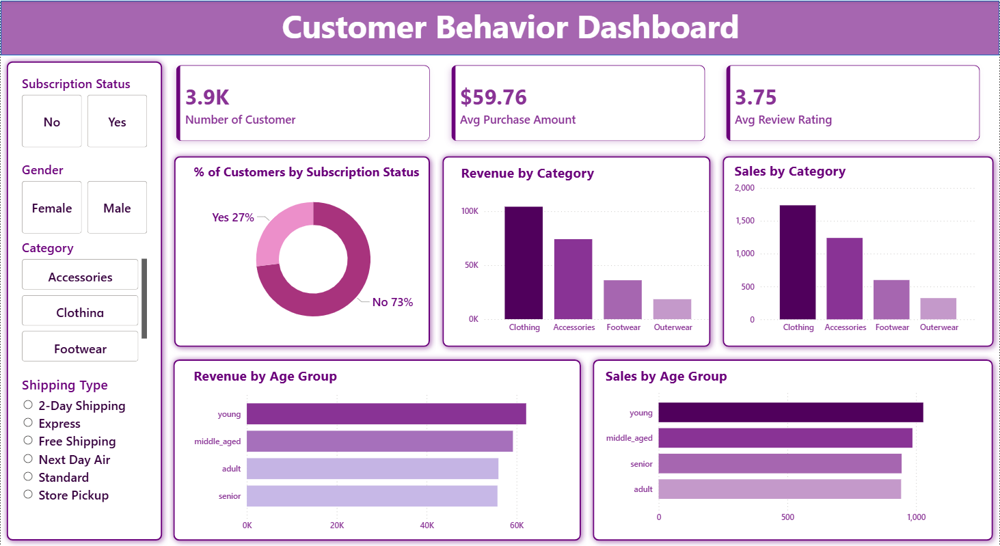

# Customer Behavior End-to-End Project 

_An end-to-end Data Analytics project that analyzes customer shopping patterns using Python, SQL, and Power BI to generate actionable business insights and an interactive dashboard._

---

## 📌 Table of Contents
- <a href="#overview">Overview</a>
- <a href="#business-problem">Business Problem</a>
- <a href="#dataset">Dataset</a>
- <a href="#tools--technologies">Tools & Technologies</a>
- <a href="#project-structure">Project Structure</a>
- <a href="#data-cleaning--preparation">Data Cleaning & Preparation</a>
- <a href="#exploratory-data-analysis-eda">Exploratory Data Analysis (EDA)</a>
- <a href="#research-questions--key-findings">Research Questions & Key Findings</a>
- <a href="#dashboard">Dashboard</a>
- <a href="#how-to-run-this-project">How to Run This Project</a>
- <a href="#final-recommendations">Final Recommendations</a>
- <a href="#author--contact">Author & Contact</a>

---
<h2><a class="anchor" id="overview"></a>Overview</h2>

This project analyzes 3,900 customer transactions to understand purchasing behavior, customer segments, subscription trends, and product performance. The goal is to help businesses make data-driven decisions around marketing, subscriptions, product strategy, and customer retention.

The workflow follows a real-world analytics pipeline: Raw Data → Python (EDA & Cleaning) → SQL (Business Analysis) → Power BI (Dashboard)

---
<h2><a class="anchor" id="business-problem"></a>Business Problem</h2>

 This project aims to find:
- Revenue comparison by gender
- Spending behavior of discount users
- Top-rated products by average review score
- Purchase comparison by shipping type
- Subscriber vs non-subscriber revenue analysis
- Identification of discount-dependent products
- Customer segmentation (New, Returning, Loyal)
- Top products within each category
- Relationship between repeat purchases and subscriptions
- Revenue contribution by age group

---
<h2><a class="anchor" id="dataset"></a>Dataset</h2>

- CSV file located in `/data/` folder (customer_shopping_behavior)


---

<h2><a class="anchor" id="tools--technologies"></a>Tools & Technologies</h2>

- SQL (Common Table Expressions, Joins, Filtering)
- Python (Pandas, Matplotlib, Seaborn, NumPy)
- Power BI (Interactive Visualizations)
- GitHub

---
<h2><a class="anchor" id="project-structure"></a>Project Structure</h2>

```
vendor-performance-analysis/
│
├── README.md
├── .gitignore
├── requirements.txt
├── Customer Shopping Behavior Analysis report.pdf
│
├── notebooks/                  # Jupyter notebooks
│   ├── customer_behavior_analysis.ipynb
│
├── sql queries/                    # PostgreSQL (aggregations & business analysis)
│   ├── customer_behavior_sql_queries
│
├── dashboard/                  # Power BI dashboard file
│   └── customer_behaviour_dashboard.pbix
```

---
<h2><a class="anchor" id="data-cleaning--preparation"></a>Data Cleaning & Preparation</h2>

- Python (Jupyter Notebook) was used as the first analytical layer to clean, explore, and validate the dataset before loading it into the database and Power BI. 
- Data Quality Notes 
 - Missing values identified in the Review Rating column 
 - Categorical values standardized for consistency across tools 


---
<h2><a class="anchor" id="exploratory-data-analysis-eda"></a>Exploratory Data Analysis (EDA)</h2>

**Key Steps**

- Loaded data using Pandas
- Performed initial inspection using info() and describe()
- Handled missing review ratings using median imputation by category
- Renamed columns to snake_case
- Feature Engineering:
 - age_group (young, adult, middle-aged, senior)
- Checked and removed redundant columns

---
<h2><a class="anchor" id="research-questions--key-findings"></a>Research Questions & Key Findings</h2>

1. Clothing is the highest revenue-generating category
2. Young and middle-aged customers drive most sales and revenue
3. Only 27% of customers are subscribers, indicating growth potential
4. Subscribers have a higher average purchase value
5. Faster shipping options are associated with higher spending

---
<h2><a class="anchor" id="dashboard"></a>Dashboard</h2>

- Power BI Dashboard shows:
  - Subscription Status Distribution (Donut Chart) 
  - Revenue by Category (Bar Chart) 
  - Sales by Category (Bar Chart) 
  - Revenue by Age Group (Horizontal Bar Chart) 
  - Sales by Age Group (Horizontal Bar Chart)



---
<h2><a class="anchor" id="how-to-run-this-project"></a>How to Run This Project</h2>

1. Clone the repository:
```bash
git clone https://github.com/yourusername/customer_behavior_analysis.git
```

2. Open and run notebooks:
   - `notebooks/customer_behavior_analysis.ipynb`

3. Create sql queries:
```bash
sql queries\customer_behavior_sql_queries.sql
```
  
4. Open Power BI Dashboard:
   - `dashboard/customer_behaviour_dashboard.pbix`

---
<h2><a class="anchor" id="final-recommendations"></a>Final Recommendations</h2>

- Increase Subscription Adoption: Offer exclusive discounts, early access, or free shipping for subscribers
- Strengthen Loyalty Programs: Target returning customers to convert them into loyal segments 
- Optimize Discount Strategy: Balance promotional offers to protect profit margins 
- Product Strategy: Promote top-rated and best-selling products in campaigns 
- Targeted Marketing: Focus on high-value age groups and high-spend shipping preferences

---
<h2><a class="anchor" id="author--contact"></a>Author & Contact</h2>

**Shruti Bade**  
 
📧 Email: shrutibade12@gmail.com
🔗 [LinkedIn]( www.linkedin.com/in/shruti-bade)  
